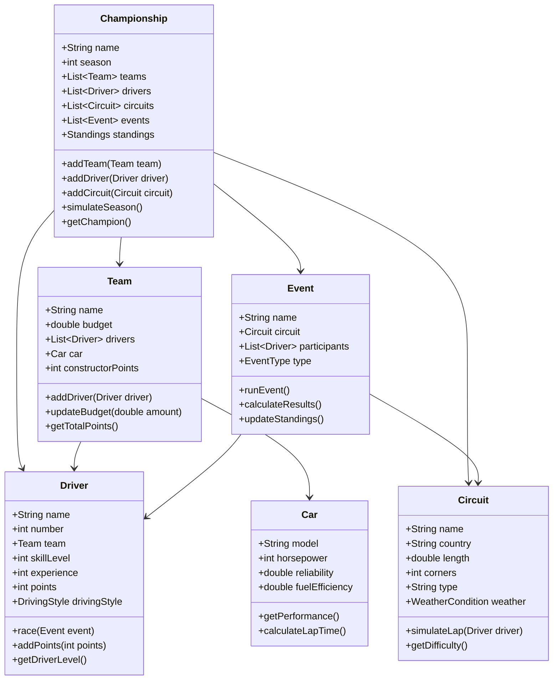

# 🏆 Урок 6: Фінальний проект - Симулятор чемпіонату F1

## 🎯 Що ви вивчите (Розширений курс)
- Як застосовувати всі принципи ООП в реальному проекті
- Архітектура складних систем з використанням ООП
- Паттерни проектування в практичному застосуванні
- Модульна архітектура та розділення відповідальності
- Системи подій та сповіщень
- Збереження та відновлення стану системи
- Тестування складних ООП систем
- Оптимізація продуктивності та пам'яті
- Розширюваність та підтримка коду
- Документування та коментарі

## 🎯 Мета проекту (Розширена)

Створити повноцінний симулятор чемпіонату Формули 1, що демонструє всі вивчені концепції ООП:

✅ **Класи та об'єкти** - Гонщики, команди, автомобілі, траси  
✅ **Інкапсуляція** - Захищені дані, валідація, контроль доступу  
✅ **Наслідування** - Ієрархія учасників, типів гонок, стратегій  
✅ **Поліморфізм** - Різні стилі водіння, стратегії, типи подій  
✅ **Абстракція** - Чисті інтерфейси, міксини, приховування складності  

## 🏎️ Архітектура системи (Детальна)

### 1. Основні компоненти та їх зв'язки

```
🏆 Championship System
├── 🏢 Teams (Ferrari, Mercedes, Red Bull...)
│   ├── 👤 Drivers (Hamilton, Verstappen, Leclerc...)
│   ├── 🏎️ Cars (RB19, W14, SF-23...)
│   └── 💰 Budget & Resources
├── 🏁 Circuits (Monaco, Silverstone, Spa...)
│   ├── 📏 Track Layout & Characteristics
│   ├── 🌤️ Weather Conditions
│   └── 🏆 Historical Data
├── 🏁 Events (Practice, Qualifying, Sprint, Race)
│   ├── ⏱️ Timing & Scoring
│   ├── 🎯 Strategies & Tactics
│   └── 📊 Results & Statistics
├── 📊 Standings (Driver + Constructor championships)
│   ├── 🏆 Points System
│   ├── 📈 Rankings & History
│   └── 🎖️ Awards & Achievements
└── 🔧 Simulation Engine
    ├── 🎲 Random Events & Accidents
    ├── 🌦️ Weather Impact
    └── ⚡ Performance Calculations
```

### 2. Детальна класова діаграма



## 💻 Ключові концепції ООП в проекті (Розширено)

### 1. Інкапсуляція (Детальна реалізація)

```dart
class Team {
  // Приватні поля - захищені дані
  String _name;
  double _budget;
  List<Driver> _drivers = [];
  Car _car;
  int _constructorPoints = 0;
  
  // Конструктор з валідацією
  Team(this._name, this._budget, this._car) {
    if (_budget < 0) {
      throw ArgumentError('Budget cannot be negative');
    }
    if (_name.isEmpty) {
      throw ArgumentError('Team name cannot be empty');
    }
  }
  
  // Геттери з контролем доступу
  String get name => _name;
  double get budget => _budget;
  List<Driver> get drivers => List.unmodifiable(_drivers);
  Car get car => _car;
  int get constructorPoints => _constructorPoints;
  
  // Сеттери з валідацією
  set budget(double value) {
    if (value >= 0) {
      _budget = value;
      print('💰 $name budget updated: \$${value.toStringAsFixed(2)}M');
    } else {
      print('⚠️ Invalid budget value: $value');
    }
  }
  
  // Контрольований доступ до методів
  void addDriver(Driver driver) {
    if (_drivers.length >= 2) {
      print('⚠️ Team $name already has 2 drivers');
      return;
    }
    
    if (driver.team != null) {
      print('⚠️ Driver ${driver.name} already belongs to a team');
      return;
    }
    
    _drivers.add(driver);
    driver.team = this;
    print('✅ ${driver.name} added to $name');
  }
  
  void removeDriver(Driver driver) {
    if (_drivers.contains(driver)) {
      _drivers.remove(driver);
      driver.team = null;
      print('❌ ${driver.name} removed from $name');
    }
  }
  
  void addConstructorPoints(int points) {
    if (points >= 0) {
      _constructorPoints += points;
      print('🏆 $name constructor points: $_constructorPoints');
    }
  }
  
  int getTotalPoints() {
    return _drivers.fold(0, (sum, driver) => sum + driver.points);
  }
  
  // Приватний метод для внутрішніх розрахунків
  double _calculateTeamPerformance() {
    if (_drivers.isEmpty) return 0.0;
    
    double driverAverage = _drivers
        .map((d) => d.skillLevel)
        .reduce((a, b) => a + b) / _drivers.length;
    
    return (driverAverage + _car.getPerformance()) / 2;
  }
  
  // Публічний метод з використанням приватного
  String getTeamStatus() {
    double performance = _calculateTeamPerformance();
    return '''
📊 $name Status:
   Drivers: ${_drivers.length}/2
   Budget: \$${_budget.toStringAsFixed(2)}M
   Constructor Points: $_constructorPoints
   Total Driver Points: ${getTotalPoints()}
   Team Performance: ${performance.toStringAsFixed(1)}/100
    ''';
  }
}
```

### 2. Наслідування (Розширена ієрархія)

```dart
// Базовий клас для всіх учасників
abstract class Participant {
  String name;
  int points = 0;
  List<String> achievements = [];
  
  Participant(this.name);
  
  // Абстрактні методи
  abstract void addPoints(int newPoints);
  abstract String getParticipantType();
  abstract String getStatus();
  
  // Конкретні методи
  void addAchievement(String achievement) {
    achievements.add(achievement);
    print('🏆 $name achieved: $achievement');
  }
  
  bool hasAchievement(String achievement) {
    return achievements.contains(achievement);
  }
  
  void displayAchievements() {
    if (achievements.isEmpty) {
      print('📋 $name has no achievements yet');
    } else {
      print('🏆 $name achievements:');
      for (String achievement in achievements) {
        print('  - $achievement');
      }
    }
  }
}

// Клас водія
class Driver extends Participant {
  int number;
  Team? team;
  int skillLevel;
  int experience;
  DrivingStyle drivingStyle;
  List<double> lapTimes = [];
  
  Driver(String name, this.number, this.skillLevel, this.experience, this.drivingStyle) 
    : super(name);
  
  @override
  void addPoints(int newPoints) {
    points += newPoints;
    print('🏆 $name scored $newPoints points! (Total: $points)');
    
    // Автоматичні досягнення
    if (points >= 100 && !hasAchievement('Century Club')) {
      addAchievement('Century Club');
    }
    if (points >= 500 && !hasAchievement('Half Millennium')) {
      addAchievement('Half Millennium');
    }
  }
  
  @override
  String getParticipantType() => 'Driver';
  
  @override
  String getStatus() {
    String teamName = team?.name ?? 'No Team';
    String level = getDriverLevel();
    
    return '''
🏎️ $name (#$number)
   Team: $teamName
   Skill Level: $skillLevel/100
   Experience: $experience years
   Points: $points
   Level: $level
   Style: ${drivingStyle.name}
    ''';
  }
  
  String getDriverLevel() {
    if (skillLevel >= 90) return 'Legend';
    if (skillLevel >= 80) return 'Elite';
    if (skillLevel >= 70) return 'Professional';
    if (skillLevel >= 60) return 'Experienced';
    if (skillLevel >= 50) return 'Rookie';
    return 'Novice';
  }
  
  void addLapTime(double time) {
    lapTimes.add(time);
  }
  
  double getBestLapTime() {
    if (lapTimes.isEmpty) return 0.0;
    return lapTimes.reduce((a, b) => a < b ? a : b);
  }
  
  double getAverageLapTime() {
    if (lapTimes.isEmpty) return 0.0;
    return lapTimes.reduce((a, b) => a + b) / lapTimes.length;
  }
  
  void race(Event event) {
    print('🏁 $name starting ${event.name}');
    drivingStyle.executeStrategy();
    
    // Симуляція гонки
    for (int lap = 1; lap <= event.totalLaps; lap++) {
      double lapTime = _simulateLap(lap);
      addLapTime(lapTime);
      
      if (lap % 10 == 0) {
        print('  Lap $lap: ${lapTime.toStringAsFixed(3)}s');
      }
    }
    
    print('🏁 $name finished ${event.name}');
  }
  
  double _simulateLap(int lapNumber) {
    // Базова швидкість + варіація + стиль водіння
    double baseTime = 85.0; // секунди
    double skillBonus = (100 - skillLevel) * 0.1;
    double styleBonus = drivingStyle.getPerformanceBonus();
    double randomVariation = (Random().nextDouble() - 0.5) * 2.0;
    
    return baseTime + skillBonus - styleBonus + randomVariation;
  }
}

// Клас команди
class Team extends Participant {
  double budget;
  List<Driver> drivers = [];
  Car car;
  int constructorPoints = 0;
  
  Team(String name, this.budget, this.car) : super(name);
  
  @override
  void addPoints(int newPoints) {
    constructorPoints += newPoints;
    print('🏆 $name constructor points: $constructorPoints');
    
    // Автоматичні досягнення команди
    if (constructorPoints >= 200 && !hasAchievement('Constructor Elite')) {
      addAchievement('Constructor Elite');
    }
  }
  
  @override
  String getParticipantType() => 'Team';
  
  @override
  String getStatus() {
    return '''
🏢 $name
   Budget: \$${budget.toStringAsFixed(2)}M
   Drivers: ${drivers.length}/2
   Constructor Points: $constructorPoints
   Total Driver Points: ${getTotalDriverPoints()}
    ''';
  }
  
  int getTotalDriverPoints() {
    return drivers.fold(0, (sum, driver) => sum + driver.points);
  }
  
  void addDriver(Driver driver) {
    if (drivers.length < 2) {
      drivers.add(driver);
      driver.team = this;
      print('✅ ${driver.name} joined $name');
    } else {
      print('⚠️ $name already has 2 drivers');
    }
  }
  
  void removeDriver(Driver driver) {
    if (drivers.contains(driver)) {
      drivers.remove(driver);
      driver.team = null;
      print('❌ ${driver.name} left $name');
    }
  }
}
```

### 3. Поліморфізм (Розширені стратегії)

```dart
// Абстрактний клас для стилів водіння
abstract class DrivingStyle {
  String name;
  double aggressionLevel;
  double consistencyLevel;
  
  DrivingStyle(this.name, this.aggressionLevel, this.consistencyLevel);
  
  // Абстрактні методи
  abstract void executeStrategy();
  abstract void performOvertake();
  abstract void defendPosition();
  abstract double getPerformanceBonus();
  
  // Конкретні методи
  void displayStyle() {
    print('''
🎯 $name Driving Style:
   Aggression: ${aggressionLevel.toStringAsFixed(1)}/10
   Consistency: ${consistencyLevel.toStringAsFixed(1)}/10
    ''');
  }
  
  bool shouldAttemptOvertake() {
    return Random().nextDouble() < aggressionLevel / 10;
  }
  
  bool shouldDefendAggressively() {
    return Random().nextDouble() < aggressionLevel / 10;
  }
}

// Агресивний стиль водіння
class AggressiveStyle extends DrivingStyle {
  AggressiveStyle() : super('Aggressive', 9.0, 6.0);
  
  @override
  void executeStrategy() {
    print('🔥 Aggressive strategy: Maximum attack mode!');
  }
  
  @override
  void performOvertake() {
    print('💨 Bold inside move with late braking!');
  }
  
  @override
  void defendPosition() {
    print('🛡️ Aggressive blocking and weaving!');
  }
  
  @override
  double getPerformanceBonus() {
    return 2.0; // Великий бонус до швидкості
  }
}

// Технічний стиль водіння
class TechnicalStyle extends DrivingStyle {
  TechnicalStyle() : super('Technical', 6.0, 9.0);
  
  @override
  void executeStrategy() {
    print('🧠 Technical strategy: Calculated precision driving');
  }
  
  @override
  void performOvertake() {
    print('📐 Calculated overtake with perfect line');
  }
  
  @override
  void defendPosition() {
    print('🎯 Strategic positioning and clean defense');
  }
  
  @override
  double getPerformanceBonus() {
    return 1.5; // Середній бонус
  }
}

// Консервативний стиль водіння
class ConservativeStyle extends DrivingStyle {
  ConservativeStyle() : super('Conservative', 3.0, 9.5);
  
  @override
  void executeStrategy() {
    print('🛡️ Conservative strategy: Safety first, consistency key');
  }
  
  @override
  void performOvertake() {
    print('⏳ Patient overtake, waiting for perfect opportunity');
  }
  
  @override
  void defendPosition() {
    print('🛡️ Defensive positioning, avoiding risks');
  }
  
  @override
  double getPerformanceBonus() {
    return 0.5; // Малий бонус, але висока консистентність
  }
}

// Адаптивний стиль водіння
class AdaptiveStyle extends DrivingStyle {
  AdaptiveStyle() : super('Adaptive', 7.0, 8.0);
  
  @override
  void executeStrategy() {
    print('🔄 Adaptive strategy: Adjusting to conditions');
  }
  
  @override
  void performOvertake() {
    if (Random().nextBool()) {
      print('💨 Aggressive overtake when opportunity presents');
    } else {
      print('📐 Technical overtake with calculated approach');
    }
  }
  
  @override
  void defendPosition() {
    if (Random().nextBool()) {
      print('🛡️ Aggressive defense when necessary');
    } else {
      print('🎯 Technical defense with clean positioning');
    }
  }
  
  @override
  double getPerformanceBonus() {
    return 1.8; // Гнучкий бонус
  }
}
```

### 4. Абстракція та міксини (Розширені можливості)

```dart
// Міксин для комунікації
mixin Communicable {
  String _lastMessage = '';
  List<String> _messageHistory = [];
  
  void sendMessage(String message) {
    _lastMessage = message;
    _messageHistory.add('SENT: $message');
    print('📻 Radio: $message');
  }
  
  void receiveMessage(String message) {
    _messageHistory.add('RECEIVED: $message');
    print('📻 Received: $message');
  }
  
  String getLastMessage() => _lastMessage;
  
  List<String> getMessageHistory() => List.unmodifiable(_messageHistory);
  
  void clearMessageHistory() {
    _messageHistory.clear();
    print('🗑️ Message history cleared');
  }
}

// Міксин для стратегій
mixin Strategical {
  String _currentStrategy = 'Default';
  List<String> _strategyHistory = [];
  Map<String, double> _strategyPerformance = {};
  
  void changeStrategy(String strategy) {
    _strategyHistory.add(_currentStrategy);
    _currentStrategy = strategy;
    print('🎯 Strategy changed: $_currentStrategy');
  }
  
  String getCurrentStrategy() => _currentStrategy;
  
  List<String> getStrategyHistory() => List.unmodifiable(_strategyHistory);
  
  void recordStrategyPerformance(String strategy, double performance) {
    _strategyPerformance[strategy] = performance;
  }
  
  String getBestStrategy() {
    if (_strategyPerformance.isEmpty) return 'Default';
    
    var best = _strategyPerformance.entries
        .reduce((a, b) => a.value > b.value ? a : b);
    
    return best.key;
  }
  
  void revertToPreviousStrategy() {
    if (_strategyHistory.isNotEmpty) {
      _currentStrategy = _strategyHistory.removeLast();
      print('🔄 Reverted to: $_currentStrategy');
    }
  }
}

// Міксин для телеметрії
mixin TelemetryCapable {
  Map<String, List<double>> _telemetryData = {};
  DateTime _lastUpdate = DateTime.now();
  
  void recordTelemetry(String parameter, double value) {
    if (!_telemetryData.containsKey(parameter)) {
      _telemetryData[parameter] = [];
    }
    _telemetryData[parameter]!.add(value);
    _lastUpdate = DateTime.now();
  }
  
  double? getLatestTelemetry(String parameter) {
    var data = _telemetryData[parameter];
    return data?.isNotEmpty == true ? data!.last : null;
  }
  
  List<double> getTelemetryHistory(String parameter) {
    return List.unmodifiable(_telemetryData[parameter] ?? []);
  }
  
  Map<String, double> getAllLatestTelemetry() {
    Map<String, double> latest = {};
    for (String parameter in _telemetryData.keys) {
      var value = getLatestTelemetry(parameter);
      if (value != null) {
        latest[parameter] = value;
      }
    }
    return latest;
  }
  
  double getAverageTelemetry(String parameter) {
    var data = _telemetryData[parameter];
    if (data == null || data.isEmpty) return 0.0;
    
    return data.reduce((a, b) => a + b) / data.length;
  }
  
  void clearTelemetry() {
    _telemetryData.clear();
    print('🗑️ Telemetry data cleared');
  }
  
  DateTime getLastUpdate() => _lastUpdate;
}

// Міксин для DRS системи
mixin DRSCapable {
  bool _drsEnabled = false;
  int _drsActivations = 0;
  int _maxDRSActivations = 0;
  DateTime? _lastDRSActivation;
  
  void activateDRS() {
    if (!_drsEnabled && _drsActivations < _maxDRSActivations) {
      _drsEnabled = true;
      _drsActivations++;
      _lastDRSActivation = DateTime.now();
      print('💨 DRS activated! (+15 km/h) - Activation $_drsActivations/$_maxDRSActivations');
    } else if (_drsEnabled) {
      print('⚠️ DRS already active');
    } else {
      print('⚠️ Maximum DRS activations reached');
    }
  }
  
  void deactivateDRS() {
    if (_drsEnabled) {
      _drsEnabled = false;
      print('🛑 DRS deactivated');
    }
  }
  
  bool isDRSEnabled() => _drsEnabled;
  
  int getDRSActivations() => _drsActivations;
  
  int getMaxDRSActivations() => _maxDRSActivations;
  
  void setMaxDRSActivations(int max) {
    _maxDRSActivations = max;
    print('⚙️ Max DRS activations set to: $max');
  }
  
  void resetDRSCounter() {
    _drsActivations = 0;
    _drsEnabled = false;
    print('🔄 DRS counter reset');
  }
  
  Duration? getTimeSinceLastDRS() {
    if (_lastDRSActivation == null) return null;
    return DateTime.now().difference(_lastDRSActivation!);
  }
}

// Розширений клас водія з міксинами
class AdvancedDriver extends Driver 
    with Communicable, Strategical, TelemetryCapable, DRSCapable {
  
  AdvancedDriver(String name, int number, int skillLevel, int experience, DrivingStyle drivingStyle) 
    : super(name, number, skillLevel, experience, drivingStyle) {
    setMaxDRSActivations(3); // 3 DRS активації за гонку
  }
  
  @override
  void race(Event event) {
    sendMessage('Starting ${event.name}');
    changeStrategy('Race Mode');
    
    print('🏁 $name starting ${event.name}');
    
    for (int lap = 1; lap <= event.totalLaps; lap++) {
      // Запис телеметрії
      recordTelemetry('lap_number', lap.toDouble());
      recordTelemetry('speed', 200.0 + Random().nextDouble() * 100);
      recordTelemetry('rpm', 12000.0 + Random().nextDouble() * 3000);
      
      // DRS логіка
      if (lap > 2 && Random().nextDouble() < 0.3) {
        activateDRS();
      }
      
      double lapTime = _simulateLap(lap);
      addLapTime(lapTime);
      
      // Деактивація DRS після використання
      if (isDRSEnabled()) {
        deactivateDRS();
      }
      
      if (lap % 10 == 0) {
        print('  Lap $lap: ${lapTime.toStringAsFixed(3)}s');
        sendMessage('Lap $lap completed: ${lapTime.toStringAsFixed(3)}s');
      }
    }
    
    print('🏁 $name finished ${event.name}');
    sendMessage('Race completed successfully');
    
    // Аналіз телеметрії
    _analyzeRaceData();
  }
  
  void _analyzeRaceData() {
    var latestTelemetry = getAllLatestTelemetry();
    double avgSpeed = getAverageTelemetry('speed');
    double avgRPM = getAverageTelemetry('rpm');
    
    print('''
📊 Race Analysis for $name:
   Average Speed: ${avgSpeed.toStringAsFixed(1)} km/h
   Average RPM: ${avgRPM.toStringAsFixed(0)}
   DRS Activations: $_drsActivations/$_maxDRSActivations
   Best Strategy: ${getBestStrategy()}
    ''');
  }
  
  @override
  String getStatus() {
    String baseStatus = super.getStatus();
    String drsStatus = isDRSEnabled() ? 'ON' : 'OFF';
    String strategy = getCurrentStrategy();
    
    return '''
$baseStatus
   DRS Status: $drsStatus
   Current Strategy: $strategy
   DRS Activations: $_drsActivations/$_maxDRSActivations
   Last Message: ${getLastMessage()}
    ''';
  }
}
```

## 🎮 Особливості симулятора (Розширені)

### ⚡ Реалістичне моделювання

```dart
class RaceSimulator {
  // Фактори, що впливають на результат
  static const Map<String, double> _weatherImpact = {
    'Dry': 1.0,
    'Wet': 0.8,
    'Rain': 0.6,
    'Fog': 0.7,
  };
  
  static const Map<String, double> _trackDifficulty = {
    'Monaco': 0.9,
    'Silverstone': 0.7,
    'Spa': 0.8,
    'Monza': 0.6,
  };
  
  static double simulateLapTime(Driver driver, Circuit circuit, String weather) {
    // Базова швидкість водія
    double baseTime = 85.0;
    
    // Вплив навичок
    double skillFactor = (100 - driver.skillLevel) * 0.1;
    
    // Вплив стилю водіння
    double styleBonus = driver.drivingStyle.getPerformanceBonus();
    
    // Вплив погоди
    double weatherFactor = _weatherImpact[weather] ?? 1.0;
    
    // Вплив складності траси
    double trackFactor = _trackDifficulty[circuit.name] ?? 0.8;
    
    // Випадкова варіація
    double randomVariation = (Random().nextDouble() - 0.5) * 2.0;
    
    // Розрахунок фінального часу
    double finalTime = (baseTime + skillFactor - styleBonus) * 
                      weatherFactor * trackFactor + randomVariation;
    
    return finalTime.clamp(70.0, 120.0); // Обмеження реалістичних значень
  }
}
```

### 📊 Система очок (Розширена)

```dart
class PointsSystem {
  // Очки за позицію в гонці
  static const Map<int, int> _racePoints = {
    1: 25, 2: 18, 3: 15, 4: 12, 5: 10,
    6: 8, 7: 6, 8: 4, 9: 2, 10: 1
  };
  
  // Очки за спринт
  static const Map<int, int> _sprintPoints = {
    1: 8, 2: 7, 3: 6, 4: 5, 5: 4, 6: 3, 7: 2, 8: 1
  };
  
  // Очки за кваліфікацію (для статистики)
  static const Map<int, int> _qualifyingPoints = {
    1: 10, 2: 8, 3: 6, 4: 4, 5: 2
  };
  
  static int getRacePoints(int position) {
    return _racePoints[position] ?? 0;
  }
  
  static int getSprintPoints(int position) {
    return _sprintPoints[position] ?? 0;
  }
  
  static int getQualifyingPoints(int position) {
    return _qualifyingPoints[position] ?? 0;
  }
  
  static int getFastestLapBonus(bool inTop10) {
    return inTop10 ? 1 : 0;
  }
  
  static String getPointsDescription(int position, String eventType) {
    int points = 0;
    switch (eventType) {
      case 'Race':
        points = getRacePoints(position);
        break;
      case 'Sprint':
        points = getSprintPoints(position);
        break;
      case 'Qualifying':
        points = getQualifyingPoints(position);
        break;
    }
    
    if (points > 0) {
      return 'P$position: $points points';
    } else {
      return 'P$position: No points';
    }
  }
}
```

## 🔧 Технічна реалізація (Розширена)

### 1. Модульна архітектура

```dart
// Основні модулі проекту
import 'models/championship.dart';
import 'models/team.dart';
import 'models/driver.dart';
import 'models/circuit.dart';
import 'models/car.dart';
import 'models/event.dart';
import 'models/standings.dart';

import 'simulation/race_engine.dart';
import 'simulation/weather_system.dart';
import 'simulation/incident_system.dart';

import 'utils/points_calculator.dart';
import 'utils/statistics.dart';
import 'utils/validators.dart';

import 'mixins/communicable.dart';
import 'mixins/strategical.dart';
import 'mixins/telemetry_capable.dart';
import 'mixins/drs_capable.dart';

import 'exceptions/championship_exceptions.dart';
import 'exceptions/validation_exceptions.dart';
```

### 2. Система подій та сповіщень

```dart
// Абстрактний клас для подій
abstract class ChampionshipEvent {
  String name;
  DateTime timestamp;
  String description;
  
  ChampionshipEvent(this.name, this.description) 
    : timestamp = DateTime.now();
  
  abstract void execute();
  abstract String getEventType();
  
  void logEvent() {
    print('📅 [${timestamp.toString()}] ${getEventType()}: $name - $description');
  }
}

// Конкретні типи подій
class DriverSigningEvent extends ChampionshipEvent {
  Driver driver;
  Team team;
  
  DriverSigningEvent(this.driver, this.team) 
    : super('Driver Signing', '${driver.name} joined ${team.name}');
  
  @override
  void execute() {
    team.addDriver(driver);
    logEvent();
  }
  
  @override
  String getEventType() => 'DRIVER_SIGNING';
}

class RaceResultEvent extends ChampionshipEvent {
  Driver driver;
  int position;
  int points;
  
  RaceResultEvent(this.driver, this.position, this.points) 
    : super('Race Result', '${driver.name} finished P$position with $points points');
  
  @override
  void execute() {
    driver.addPoints(points);
    logEvent();
  }
  
  @override
  String getEventType() => 'RACE_RESULT';
}

class IncidentEvent extends ChampionshipEvent {
  Driver driver;
  String incidentType;
  int penaltyPoints;
  
  IncidentEvent(this.driver, this.incidentType, this.penaltyPoints) 
    : super('Incident', '${driver.name} - $incidentType (${penaltyPoints}pt penalty)');
  
  @override
  void execute() {
    driver.addPoints(-penaltyPoints);
    logEvent();
  }
  
  @override
  String getEventType() => 'INCIDENT';
}

// Система управління подіями
class EventManager {
  List<ChampionshipEvent> _events = [];
  
  void addEvent(ChampionshipEvent event) {
    _events.add(event);
  }
  
  void executeAllEvents() {
    print('🎬 Executing all championship events...');
    for (var event in _events) {
      event.execute();
    }
    print('✅ All events executed');
  }
  
  void clearEvents() {
    _events.clear();
  }
  
  List<ChampionshipEvent> getEventsByType(String type) {
    return _events.where((event) => event.getEventType() == type).toList();
  }
  
  void displayEventHistory() {
    print('\n📋 Championship Event History:');
    for (var event in _events) {
      print('  ${event.timestamp}: ${event.name} - ${event.description}');
    }
  }
}
```

## 📈 Можливості розширення (Розширені)

### 🚀 Версія 2.0 (Детальний план)

```dart
// Графічний інтерфейс з Flutter
class F1ChampionshipApp extends StatelessWidget {
  @override
  Widget build(BuildContext context) {
    return MaterialApp(
      title: 'F1 Championship Simulator',
      theme: ThemeData(
        primarySwatch: Colors.red,
        visualDensity: VisualDensity.adaptivePlatformDensity,
      ),
      home: ChampionshipDashboard(),
    );
  }
}

// База даних для збереження сезонів
class ChampionshipDatabase {
  static const String _dbName = 'f1_championship.db';
  
  Future<void> saveChampionship(Championship championship) async {
    // Збереження в SQLite або Hive
  }
  
  Future<Championship?> loadChampionship(int season) async {
    // Завантаження з бази даних
  }
  
  Future<List<Championship>> getAllSeasons() async {
    // Отримання всіх сезонів
  }
}

// Мультиплеєр система
class MultiplayerManager {
  List<Player> connectedPlayers = [];
  
  void addPlayer(Player player) {
    connectedPlayers.add(player);
  }
  
  void broadcastEvent(ChampionshipEvent event) {
    for (var player in connectedPlayers) {
      player.receiveEvent(event);
    }
  }
}

// ШІ стратегії
class AIStrategyEngine {
  static String generateOptimalStrategy(Driver driver, Circuit circuit, String weather) {
    // Аналіз даних та генерація оптимальної стратегії
    return 'Optimal strategy for ${driver.name}';
  }
  
  static bool shouldPitNow(Driver driver, int currentLap, int totalLaps) {
    // Логіка для визначення оптимального моменту піт-стопу
    return false;
  }
}
```

## 🏁 Результат навчання (Розширений)

Після завершення проекту ви будете знати:

✅ **Проектування класів** - Як створювати ефективну архітектуру  
✅ **ООП принципи** - Практичне застосування всіх концепцій  
✅ **Моделювання реальності** - Як перетворити реальні системи в код  
✅ **Розширюваність** - Як писати код, що легко модифікувати  
✅ **Тестування** - Як перевіряти правильність роботи системи  
✅ **Документування** - Як створювати зрозумілу документацію  
✅ **Оптимізація** - Як покращувати продуктивність  
✅ **Версіонування** - Як планувати розвиток проекту  

## 💡 Поради для розробки (Розширені)

### 🎯 Етапи розробки (Детальний план)

1. **Планування (1-2 дні)**
   - Визначити основні класи та їх зв'язки
   - Створити діаграми архітектури
   - Планувати модульну структуру

2. **Прототип (3-5 днів)**
   - Створити базові класи
   - Реалізувати основну функціональність
   - Протестувати базові сценарії

3. **Розширення (5-7 днів)**
   - Додати деталі та реалізм
   - Реалізувати складні алгоритми
   - Додати систему подій

4. **Тестування (2-3 дні)**
   - Перевірити різні сценарії
   - Знайти та виправити помилки
   - Оптимізувати продуктивність

5. **Документування (1-2 дні)**
   - Створити README файл
   - Документувати API
   - Написати інструкції користувача

### 🔧 Корисні паттерни (Детальний опис)

```dart
// Factory Pattern - Створення об'єктів
class DriverFactory {
  static Driver createDriver(String type, String name, int number) {
    switch (type) {
      case 'aggressive':
        return AdvancedDriver(name, number, 85, 5, AggressiveStyle());
      case 'technical':
        return AdvancedDriver(name, number, 80, 8, TechnicalStyle());
      case 'conservative':
        return AdvancedDriver(name, number, 75, 10, ConservativeStyle());
      default:
        return AdvancedDriver(name, number, 70, 3, AdaptiveStyle());
    }
  }
}

// Observer Pattern - Сповіщення про події
abstract class ChampionshipObserver {
  void onDriverSigning(Driver driver, Team team);
  void onRaceResult(Driver driver, int position, int points);
  void onChampionshipUpdate(Standings standings);
}

class ChampionshipNotifier {
  List<ChampionshipObserver> _observers = [];
  
  void addObserver(ChampionshipObserver observer) {
    _observers.add(observer);
  }
  
  void notifyDriverSigning(Driver driver, Team team) {
    for (var observer in _observers) {
      observer.onDriverSigning(driver, team);
    }
  }
}

// Strategy Pattern - Різні алгоритми
abstract class ScoringStrategy {
  abstract int calculatePoints(int position, String eventType);
}

class StandardScoringStrategy extends ScoringStrategy {
  @override
  int calculatePoints(int position, String eventType) {
    return PointsSystem.getRacePoints(position);
  }
}

class SprintScoringStrategy extends ScoringStrategy {
  @override
  int calculatePoints(int position, String eventType) {
    return PointsSystem.getSprintPoints(position);
  }
}

// Command Pattern - Команди та операції
abstract class ChampionshipCommand {
  abstract void execute();
  abstract void undo();
}

class AddDriverCommand extends ChampionshipCommand {
  Driver driver;
  Team team;
  bool wasExecuted = false;
  
  AddDriverCommand(this.driver, this.team);
  
  @override
  void execute() {
    if (!wasExecuted) {
      team.addDriver(driver);
      wasExecuted = true;
    }
  }
  
  @override
  void undo() {
    if (wasExecuted) {
      team.removeDriver(driver);
      wasExecuted = false;
    }
  }
}
```

---

💡 **Пам'ятайте**: Фінальний проект - це демонстрація всього, що ви вивчили. Не бійтеся експериментувати та додавати власні ідеї! Створіть щось унікальне та цікаве! 🏆🏎️ 